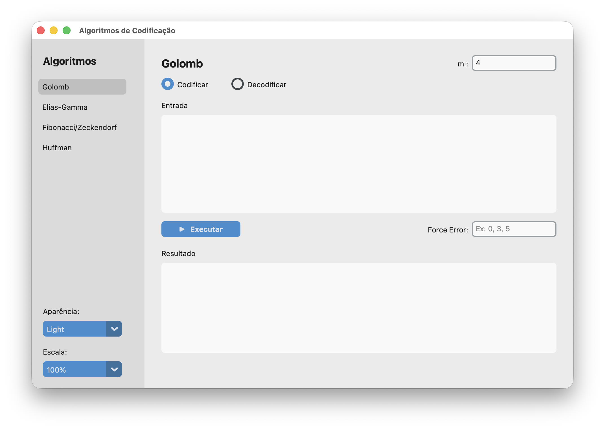
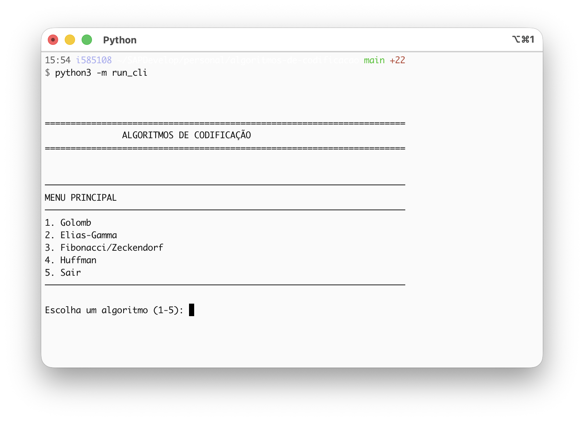
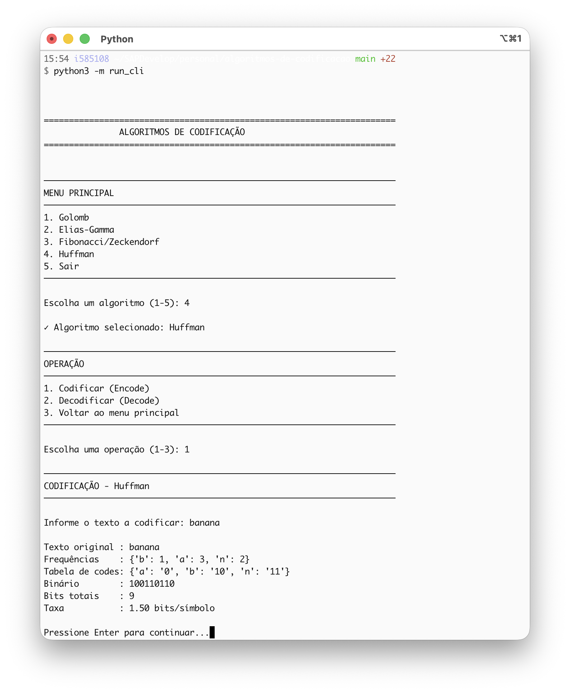
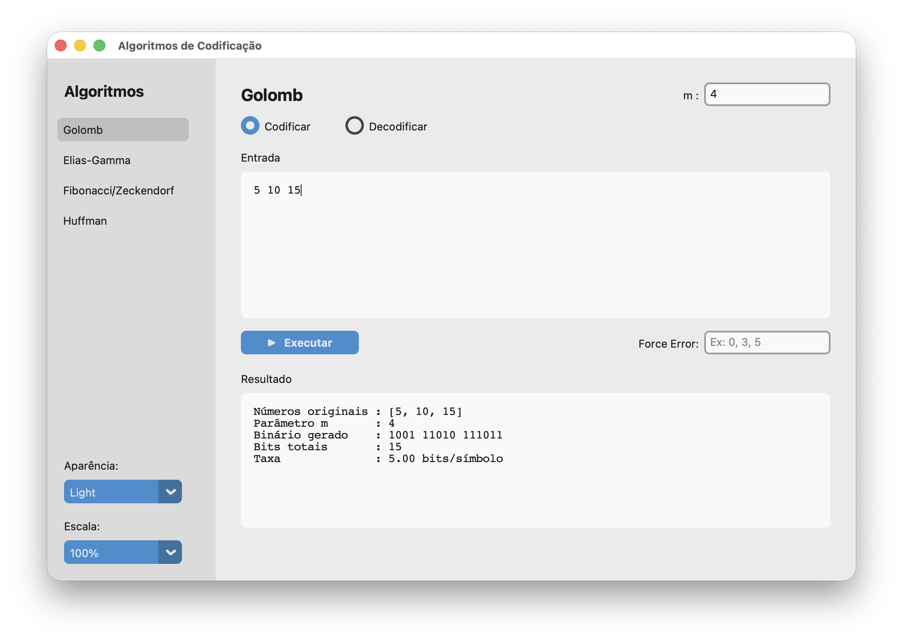
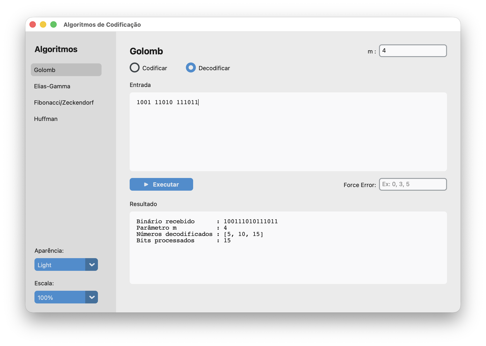
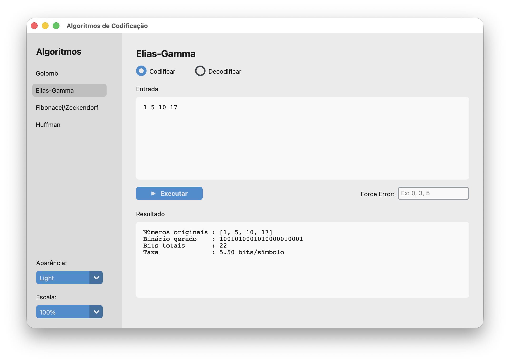
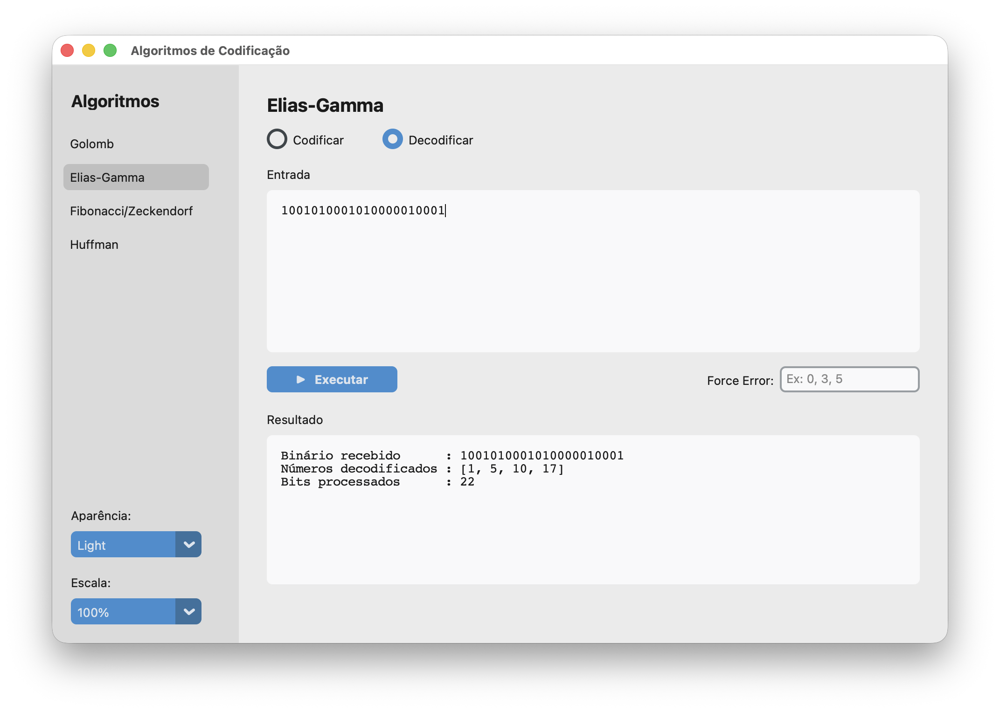
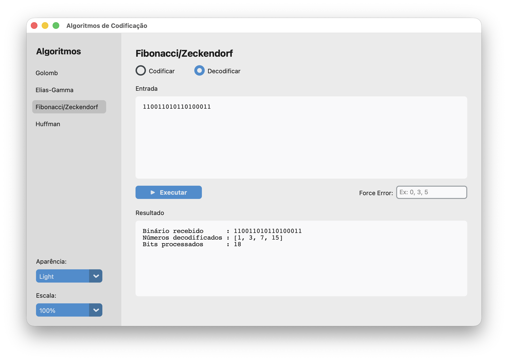
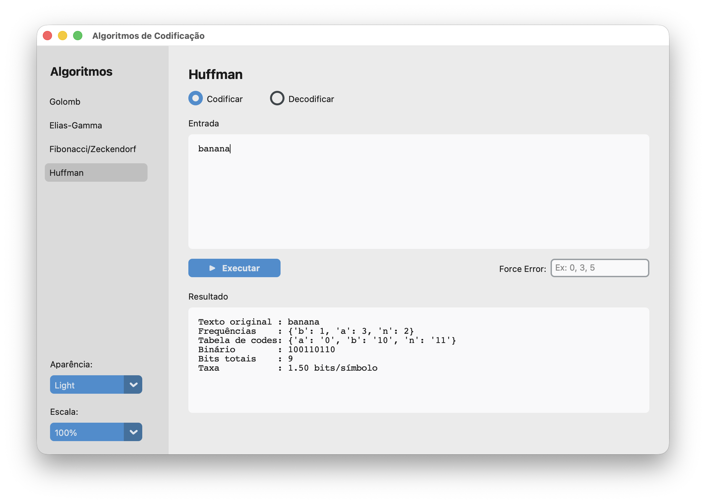
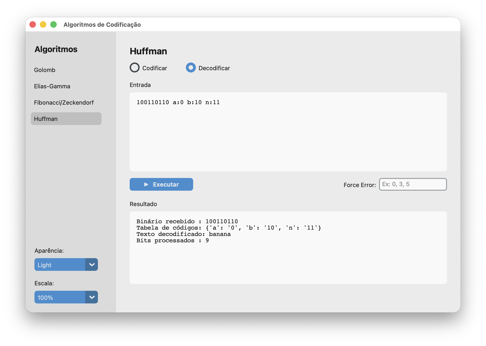

# Algoritmos de Codificacao

Projeto educacional que implementa quatro algoritmos classicos de codificacao de dados, com interfaces grafica (GUI) e linha de comando (CLI), validacao de entradas, testes automatizados e injecao de erros para simulacao de corrompimento de bits.

---

## Sumario

1. [Estrutura do Repositorio](#estrutura-do-repositorio)
2. [Tecnologias Utilizadas](#tecnologias-utilizadas)
3. [Como Executar](#como-executar)
4. [Interfaces Disponiveis](#interfaces-disponiveis)
5. [Validacoes de Entrada](#validacoes-de-entrada)
6. [Algoritmos](#algoritmos)
   - [Golomb](#golomb)
   - [Elias-Gamma](#elias-gamma)
   - [Fibonacci / Zeckendorf](#fibonacci--zeckendorf)
   - [Huffman](#huffman)
7. [Injecao de Erros](#injecao-de-erros)
8. [Testes](#testes)
9. [Comparativo dos Algoritmos](#comparativo-dos-algoritmos)

---

## Estrutura do Repositorio

```txt
algoritmos-de-codificacao/
├── src/
│   ├── encoders/
│   │   ├── golomb.py            # Encoder Golomb
│   │   ├── elias_gamma.py       # Encoder Elias-Gamma
│   │   ├── fibonacci.py         # Encoder Fibonacci/Zeckendorf
│   │   └── huffman.py           # Encoder Huffman
│   ├── decoders/
│   │   ├── golomb_decoder.py    # Decoder Golomb
│   │   ├── elias_gamma_decoder.py
│   │   ├── fibonacci_decoder.py
│   │   └── huffman_decoder.py
│   ├── interface/
│   │   ├── cli.py               # Interface linha de comando
│   │   └── gui.py               # Interface grafica (CustomTKinter)
│   └── utils/
│       ├── binary_utils.py      # Conversoes e analise binaria
│       └── validation.py        # Funcoes de validacao de entrada
├── tests/
│   ├── test_golomb.py
│   ├── test_elias_gamma.py
│   ├── test_fibonacci.py
│   └── test_huffman.py
├── .gitignore
├── requirements.txt             # Dependencias utilizadas no projeto
├── run_cli.py                   # Ponto de entrada da CLI
└── run_gui.py                   # Ponto de entrada da GUI
```

---

## Tecnologias Utilizadas

| Categoria          | Tecnologia            | Versao Minima | Uso                                      |
|--------------------|-----------------------|---------------|------------------------------------------|
| Linguagem          | Python                | 3.8+          | Toda a implementacao                     |
| Interface grafica  | CustomTKinter         | 5.2.2         | GUI multiplataforma com tema moderno     |
| Testes             | pytest                | 7.4.0         | Execucao dos testes automatizados        |

---

## Como Executar

```bash
# 1. Instalar dependencias
pip install -r requirements.txt

# 2. Interface grafica
python run_gui.py

# 3. Interface linha de comando
python run_cli.py

# 4. Executar todos os testes
pytest

# 5. Testes com relatorio de cobertura
pytest --cov=src
```

---

## Interfaces Disponiveis

### GUI (Interface Grafica)

A interface grafica usa CustomTKinter e é organizada em duas áreas principais:

**Barra lateral (fixa, 200px):**

- Botoes de selecao de algoritmo: Golomb, Elias-Gamma, Fibonacci/Zeckendorf, Huffman
- Seletor de tema: Dark / Light / System
- Seletor de escala: 80% a 120%

**Painel central (expansivel):**

- Titulo com o nome do algoritmo selecionado
- Campo do parametro `m` (visivel apenas para Golomb)
- Alternador Codificar / Decodificar
- Caixa de texto de entrada
- Botao de execucao
- Campo de injecao de erros (visivel apenas no modo Codificar)
- Caixa de resultado (somente leitura)
- Label de erro em vermelho



### CLI (Linha de Comando)

Menu interativo com 4 algoritmos. Para cada algoritmo, o usuario escolhe entre codificar e decodificar e informa os dados de entrada. A CLI aceita interrupcao via `Ctrl+C`.




---

## Validacoes de Entrada

As validacoes sao aplicadas antes de qualquer processamento, tanto na GUI quanto na CLI.

### Algoritmos baseados em numeros inteiros (Golomb, Elias-Gamma, Fibonacci)

| Regra                                | Mensagem de erro                                                   |
|--------------------------------------|--------------------------------------------------------------------|
| Entrada nao pode ser vazia           | `A entrada nao pode estar vazia.`                                  |
| Apenas inteiros positivos (> 0)      | `Este algoritmo requer numeros positivos (> 0).`                   |
| Nao aceita booleanos                 | Erro de tipo antes do processamento                                |
| Nao aceita floats ou strings         | Erro de tipo antes do processamento                                |
| Parametro `m` do Golomb deve ser > 0 | `Parametro m deve ser um inteiro positivo.`                        |

### Huffman — Codificar

| Regra                     | Mensagem de erro                        |
|---------------------------|-----------------------------------------|
| Texto nao pode estar vazio| `A entrada nao pode estar vazia.`       |
| Deve ser string           | Erro de tipo antes do processamento     |

### Huffman — Decodificar

| Regra                                     | Mensagem de erro                                          |
|-------------------------------------------|-----------------------------------------------------------|
| Codigo binario so aceita `0` e `1`        | `Codigo binario invalido — use apenas 0 e 1.`             |
| Tabela de codigos nao pode ser vazia      | Validado antes do processamento                           |
| Tabela deve ser prefix-free               | Validado ao construir a tabela                            |
| Todos os bits devem ser consumidos        | Erro se sobrar bits sem correspondencia na tabela         |

### Decodificacao Binaria (todos os algoritmos)

| Regra                                         | Descricao                                              |
|-----------------------------------------------|--------------------------------------------------------|
| Apenas caracteres `0` e `1`                   | Espacos sao removidos antes da validacao               |
| Sequencia unaria deve ter terminador          | Golomb e Elias-Gamma requerem `0` apos os `1`s         |
| Sequencia Fibonacci deve terminar com `11`    | Terminador obrigatorio para cada numero codificado     |
| Parte binaria deve estar completa             | Nao pode ser truncada no meio de um codigo             |

---

## Algoritmos

### Golomb

**Tipo:** Parametrizado | **Entrada:** Inteiros positivos (> 0) | **Parametro:** `m` (padrao = 4)

Algoritmo de compressao ideal para distribuicoes geometricas. Cada numero e representado por uma parte unaria (quociente) e uma parte binaria (resto da divisao por `m`).

#### Codificacao | Golomb

```txt
Para cada numero n:
  1. valor_interno = n - 1
  2. k = ceil(log2(m))
  3. c = 2^k - m
  4. q = valor_interno // m
  5. r = valor_interno % m

  Parte unaria: "1" * q + "0"
  Parte binaria:
    - Se r < c: representar r em (k-1) bits
    - Se r >= c: representar (r + c) em k bits

  Codigo = parte_unaria + parte_binaria
```

#### Decodificacao | Golomb

```txt
1. Contar os "1"s consecutivos → q (quociente)
2. Consumir o "0" terminador
3. Ler (k-1) bits e verificar se r < c:
   - Se sim: r = valor dos (k-1) bits
   - Se nao: ler mais 1 bit e calcular r = valor_de_k_bits - c
4. valor_interno = q * m + r
5. n = valor_interno + 1
```

#### Exemplo (m=4) | Golomb

```txt
Entrada: [1, 2, 3]

  n=1: valor_interno=0, q=0, r=0, k=2, c=0 → "0" + "00" = "000"
  n=2: valor_interno=1, q=0, r=1, k=2, c=0 → "0" + "01" = "001"
  n=3: valor_interno=2, q=0, r=2, k=2, c=0 → "0" + "10" = "010"

Codificado: "000 001 010"
Total de bits: 9 | Taxa: 3,0 bits/simbolo
```

#### Estrutura do resultado | Golomb

```python
GolombResult:
  numbers:       List[int]   # Numeros originais
  m:             int         # Parametro utilizado
  encoded_parts: List[str]   # Partes codificadas individualmente
  encoded:       str         # String binaria completa (com espacos)
  total_bits:    int         # Total de bits
  rate:          float       # Bits por simbolo
```

#### Demonstracao UI | Golomb



Uso do parâmetro `m` e codificação de uma sequência de números inteiros não negativos.



Uso do parâmetro `m` e decodificação de uma sequência de números inteiros não negativos.

---

### Elias-Gamma

**Tipo:** Universal | **Entrada:** Inteiros positivos (> 0) | **Parametro:** Nenhum

Codigo universal auto-delimitado, sem necessidade de parametros. Cada numero e representado pelo comprimento de seu binario (em unario) seguido do binario em si.

#### Codificacao | Elias-Gamma

```txt
Para cada numero n:
  1. binario(n) = representacao binaria de n
     Exemplo: n=5 → "101"
  2. prefixo = len(binario) - 1 zeros
     Exemplo: len("101") - 1 = 2 → "00"
  3. codigo = prefixo + binario
     Exemplo: "00" + "101" = "00101"
```

#### Decodificacao | Elias-Gamma

```txt
Enquanto houver bits:
  1. Contar zeros iniciais → N
  2. Ler os proximos N+1 bits como binario
  3. Converter para decimal
  4. Avancar para o proximo numero
```

#### Exemplo | Elias-Gamma

```txt
Entrada: [1, 2, 5]

  n=1: binario="1"   → 0 zeros + "1"   = "1"
  n=2: binario="10"  → 1 zero  + "10"  = "010"
  n=5: binario="101" → 2 zeros + "101" = "00101"

Codificado: "101000101"  (concatenado, sem separadores)
Total de bits: 9 | Taxa: 3,0 bits/simbolo
```

#### Estrutura do resultado | Elias-Gamma

```python
EliasGammaResult:
  numbers:    List[int]
  encoded:    str    # Concatenacao de todos os codigos (sem espaco)
  total_bits: int
  rate:       float
```

#### Demonstacao UI | Elias-Gamma



Codificação de texto, tabela de códigos gerada e análise visual do resultado.



Codificação de texto, tabela de códigos gerada e análise visual do resultado.

---

### Fibonacci / Zeckendorf

**Tipo:** Universal | **Entrada:** Inteiros positivos (> 0) | **Parametro:** Nenhum

Baseia-se no Teorema de Zeckendorf: todo inteiro positivo pode ser representado de forma unica como soma de numeros de Fibonacci nao-consecutivos. O terminador `"11"` separa os numeros codificados.

#### Codificacao | Fibonacci

```txt
Para cada numero n:
  1. Gerar sequencia de Fibonacci: F = [1, 2, 3, 5, 8, 13, ...]
  2. Algoritmo guloso do maior Fibonacci <= n para o menor:
     - Se F[i] <= restante: bit = "1", restante -= F[i]
     - Caso contrario: bit = "0"
  3. Adicionar terminador "1" ao final (forma "11" com o ultimo 1 da decomposicao)
```

#### Decodificacao | Fibonacci

```txt
Enquanto houver bits:
  1. Ler bits ate encontrar "11" (terminador)
  2. Para cada bit "1" na posicao i, somar F[i] ao resultado
  3. "11" final nao e somado — e apenas delimitador
```

#### Exemplo | Fibonacci

```txt
Entrada: [1, 7]

  n=1: F=[1,2,3,5...], usa F1=1 → bits="1" + term "1" = "11"
  n=7: 7 = 5 + 2 = F4 + F2 → bits="0101" + term "1" = "01011"

Codificado: "1101011"
```

#### Exemplo com multiplos numeros | Fibonacci

```txt
Entrada: [1, 2, 3]

  n=1: "11"
  n=2: "011"
  n=3: "0011"

Codificado: "110110011"
Total de bits: 9 | Taxa: 3,0 bits/simbolo
```

#### Estrutura do resultado | Fibonacci

```python
FibonacciResult:
  numbers:    List[int]
  encoded:    str    # Concatenacao com terminadores
  total_bits: int
  rate:       float
```

#### Demonstracao UI | Fibonacci


Uso do parâmetro `m` e codificação de uma sequência de números inteiros não negativos.



Uso do parâmetro `m` e decodificação de uma sequência de números inteiros não negativos.

---

### Huffman

**Tipo:** Estatistico | **Entrada:** Texto (qualquer string, incluindo Unicode) | **Parametro:** Nenhum

Compressao baseada em frequencia. Caracteres mais frequentes recebem codigos mais curtos. Requer a tabela de codigos para decodificacao.

#### Codificacao | Huffman

```txt
1. Tabela de frequencias: contar ocorrencias de cada caractere
2. Construir arvore de Huffman:
   a. Inserir todos os pares (char, freq) em uma fila de prioridade (min-heap)
   b. Repetidamente remover os dois nos de menor frequencia
   c. Criar no pai com freq = soma das freqs dos filhos
   d. Repetir ate restar apenas a raiz
3. Gerar tabela de codigos:
   - Percorrer a arvore: ir para a esquerda = "0", para a direita = "1"
   - Cada folha corresponde a um caractere e seu codigo
4. Codificar o texto: substituir cada caractere pelo seu codigo
```

#### Decodificacao | Huffman

```txt
Entrada: string binaria + tabela de codigos

1. Inverter tabela (codigo → caractere)
2. Percorrer a string binaria bit a bit
3. Acumular bits em um buffer
4. Quando o buffer corresponder a um codigo na tabela:
   - Emitir o caractere
   - Limpar o buffer
5. Continuar ate o fim da string
6. Se o buffer nao for vazio no final: erro (bits invalidos)
```

#### Formato de entrada para decodificacao (GUI e CLI) | Huffman

```txt
<codigo_binario> <char>:<codigo> <char>:<codigo> ...

Exemplo:
  001 a:0 b:10 c:11
  0010110 h:00 e:01 l:10 o:11
```

#### Exemplo | Huffman

```txt
Entrada: "aab"

  Frequencias: {'a': 2, 'b': 1}
  Arvore: raiz(3) → esq: a(2), dir: b(1)
  Tabela: {'a': '0', 'b': '1'}

  Codificacao:
    'a' → "0"
    'a' → "0"
    'b' → "1"
  Resultado: "001"
  Total: 3 bits | Taxa: 1,0 bit/caractere
```

#### Propriedades importantes | Huffman

- **Prefix-free:** Nenhum codigo e prefixo de outro (garantido pela estrutura da arvore)
- **Otimo:** Melhor compressao possivel para codigos de tamanho variavel baseados em frequencia
- **Caso especial:** Se o texto tem apenas um caractere unico, o codigo atribuido e `"0"`
- **Unicode:** Funciona com qualquer caractere (emojis, acentos, simbolos, etc.)

#### Estrutura do resultado | Huffman

```python
HuffmanResult:
  text:        str             # Texto original
  freq_table:  Dict[str, int]  # Frequencia de cada caractere
  code_table:  Dict[str, str]  # Tabela char → codigo binario
  encoded:     str             # String binaria completa (sem espacos)
  total_bits:  int
  rate:        float           # Bits por caractere
```

#### Demonstracao UI | Huffman



Codificação de texto, tabela de códigos gerada e análise visual do resultado.



Codificação de texto, tabela de códigos gerada e análise visual do resultado.

---

## Injecao de Erros

A GUI oferece um campo chamado **"Injecao de Erros"** no modo Codificar. Ele permite simular corrompimento de bits na saida codificada.

**Formato:** indices separados por virgula  
**Exemplo:** `0, 3, 5` inverte os bits nas posicoes 0, 3 e 5 do codigo gerado

```txt
Codigo original:  001011010
Indices errados:  0, 3, 5
Codigo corrompido: 101111010
                   ^  ^ ^
                   0  3 5  (bits invertidos)
```

**Objetivo:** Demonstrar a sensibilidade de cada algoritmo a erros de transmissao. Os testes automatizados tambem cobrem cenarios de injecao de erros, verificando que dados corrompidos produzem resultados diferentes ou erros de decodificacao.

---

## Testes

Os testes ficam em `/tests/` e cobrem as seguintes categorias para cada algoritmo:

| Categoria             | O que testa                                                                  |
|-----------------------|------------------------------------------------------------------------------|
| `TestEncode`          | Codificacao individual, em lista, estrutura do resultado, valores conhecidos |
| `TestDecode`          | Decodificacao, deteccao de binario invalido, sequencias incompletas          |
| `TestRoundtrip`       | Ciclo completo encode → decode → original, incluindo numeros grandes         |
| `TestRoundtripErrors` | Injecao de bit flip, verificacao que dados corrompidos diferem/erram         |
| `TestValidation`      | Rejeicao de zero, negativos, booleanos, vazios, tipos incorretos             |
| `TestFrequencyTable`  | Contagem de frequencias (Huffman)                                            |

```bash
# Executar testes de um algoritmo especifico
pytest tests/test_golomb.py
pytest tests/test_huffman.py

# Executar uma categoria especifica
pytest tests/test_golomb.py::TestRoundtrip

# Com cobertura
pytest --cov=src --cov-report=term-missing
```

---

## Comparativo dos Algoritmos

| Aspecto              | Golomb           | Elias-Gamma       | Fibonacci          | Huffman              |
|----------------------|------------------|-------------------|--------------------|----------------------|
| **Tipo**             | Parametrizado    | Universal         | Universal          | Estatistico          |
| **Entrada**          | Inteiros > 0     | Inteiros > 0      | Inteiros > 0       | Texto/string         |
| **Parametros**       | `m` (padrao=4)   | Nenhum            | Nenhum             | Nenhum               |
| **Codificacao**      | Unario+Binario   | Unario+Binario    | Zeckendorf + "11"  | Arvore de frequencia |
| **Complexidade**     | O(n)             | O(log n)          | O(log n)           | O(n log n)           |
| **Ideal para**       | Dist. geometrica | Numeros pequenos  | Representacao unica| Frequencia variada   |
| **Auto-delimitado**  | Sim              | Sim               | Sim                | Sim (pela arvore)    |
| **Requer tabela**    | Nao              | Nao               | Nao                | Sim (so decode)      |
| **Separador**        | Zero unario      | Implícito         | `"11"` terminador  | Estrutura da arvore  |
| **Caso limite**      | n grande, m=1    | Valores grandes   | Qualquer valor     | Texto de 1 caractere |
